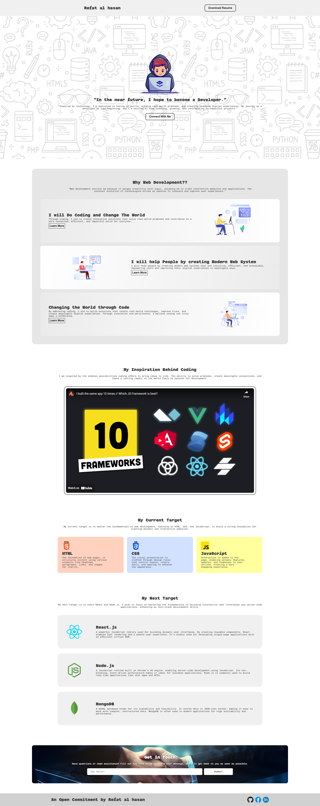

# Devtobe

A simple responsive website built to showcase my fundamental skills in **HTML** and **CSS**. This project focuses on clean structure, responsive design, and modern styling practices to strengthen my foundation in web development.

## 🚀 Technologies Used

- HTML5  
- CSS3  
- Responsive Design (Media Queries, Flexbox, Grid)

## 🌐 Live

[Click here to see live website](https://refatalhasankaif.github.io/devtobe/)

## 🖼️ Preview

